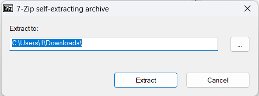

# Windows 校园 SMB 共享服务使用指南
> ?重要提示：如需添加游戏等资源，请联系管理员处理！

## 一、核心信息（必看）
- 服务器地址：`\\10.88.202.59`（复制即用，勿漏反斜杠）
- 登录凭据：
  - 用户名：**user**
  - 密码：**暂无**
- 适用网络：支持「校园网络」~~（校外也可以连接）~~（只是只有50mbps的速度。。。你懂的）

## 二、两种连接方法（任选其一）
### 方法一：直接通过文件资源管理器访问（推荐）
1. 打开浏览器，并登录Alist

   [学生目录]( 10.88.202.59:5244； "学生目录")

~~2. 成功后直接进入共享文件夹，可查看/使用内部文件。~~
 3、若没有密码，请点击
> 以访客登录，点击临时文件夹，里面有一个文件叫“游戏.exe”。下载并点击，会弹出一个选择界面。如图

最后再点击里面的“游戏”。用户名及密码请参照**核心信息**
***PS：你想拥有专属的账户嘛？欢迎联系我们***
### 方法二：映射网络驱动器
1. 打开「文件资源管理器」，右键点击左侧「此电脑」；
2. 选择「映射网络驱动器」；
3. 在「文件夹」输入框中，粘贴地址：`\\10.88.202.59\游戏`
4. 勾选「使用其他凭据连接」，点击「完成」；
5. 弹出认证窗口，输入用户名「user」、密码「暂无」，勾选「记住我的凭据」，点击「确定」；
6. 成功后，「此电脑」会新增「网络驱动器图标」，下次直接双击即可打开，无需重复连接。

## 三、常见问题解决（连接失败看这里）
1. ? 无法连接服务器？  
   检查：是否已连接「校园网络」（切换至校园WiFi/网线）；
2. ? 地址报错？  
   核对：服务器地址是否为 `\\10.88.202.59`（勿少输反斜杠、勿输错数字）；
3. ? 登录失败？  
   确认：用户名是「user」，密码为「暂无」（若无法登录，联系管理员确认）；
4. ? 仍无法连接？  
   尝试：退出文件资源管理器后重新操作，或重新输入凭据。

## 四、注意事项
1. 仅在校内网络可用，校外（如家庭网络、手机热点）无法访问；
2. 勾选「记住我的凭据」后，同一台电脑下次无需重复输入账号密码；
3. 请勿修改/删除共享文件夹内的系统文件，避免影响所有用户使用。

#若想添加游戏，请将游戏名称写在纸上并放到高一二班10226柜子

