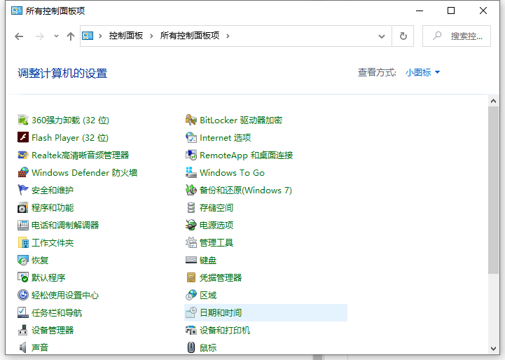
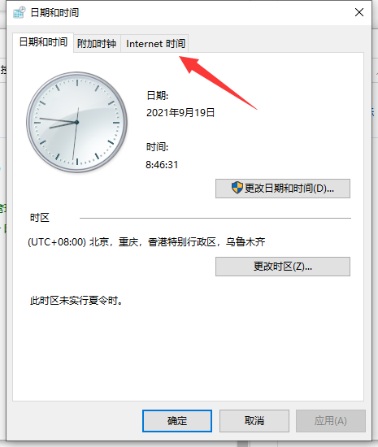
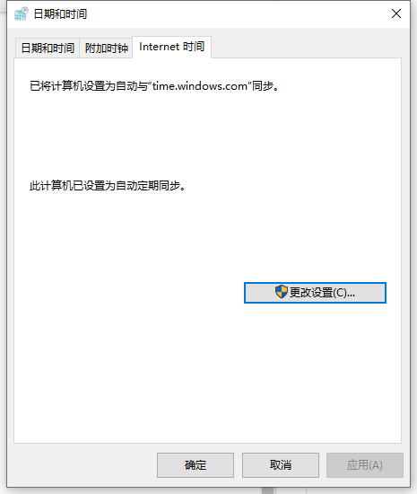
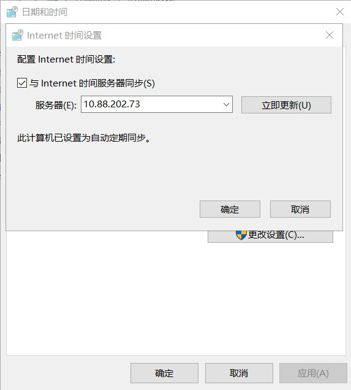

# Windows Time Server 使用指南
你是否有过明明在电脑中调整好了时间，但在下一次电脑时间又重置了的情况？
这是因为大部分班中的电脑中的COMS电池都没电啦支持不了电脑在关机后无法继续计算时间。所以，我们需要配置Windows Time Server来解决这个问题，这样，我们就不用每天都耗时耗力地调整时间啦~

## 什么是Windows Time Server？
Windows时间同步服务器（Windows Time Service）是Windows操作系统内置的时间同步服务，它使用NTP（网络时间协议）确保计算机时钟与标准时间源保持同步。这项服务对于维护系统安全、确保日志记录准确性以及协调分布式系统操作至关重要。

## 如何配置Windows Time Server？

### 1. 打开“控制面板”
  
### 2. 在日期和时间选项卡，选择Internet时间选项卡，如下图所示
 
### 3.在internet时间选项卡点击更改设置按钮，如下图所示
 
### 4. 点击“更改设置”
 
### 5. 选择“使用以下NTP服务器”
 
### 6. 输入NTP服务器地址

<pre>
<code class="language-javascript">10.88.202.73</code>
</pre>

 
### 7.点击“确定”
这样就好啦~(ゝ∀･)