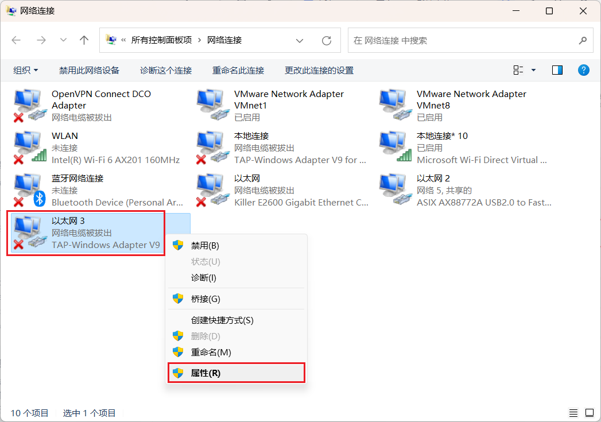
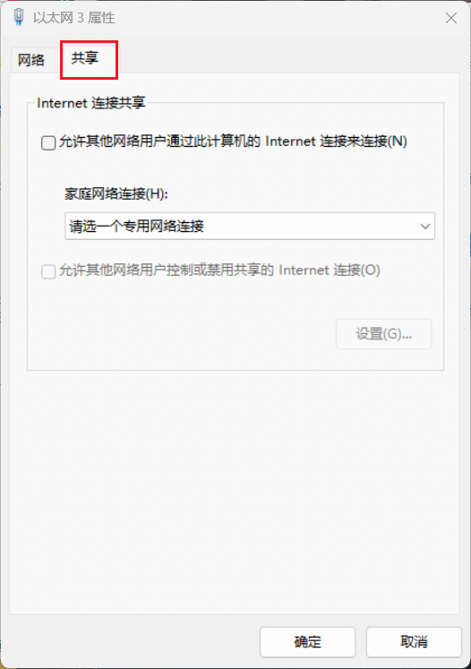
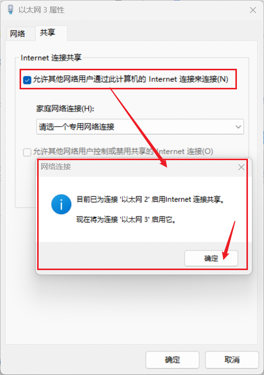

1.. # 怎么在学校访问互联网（进阶版）
相信连接过学校Wi-Fi的同学一定有过这样的经历：明明已经连接到了学校Wi-Fi，却只有不到1MB/s的速度甚至只有1KB/s的速度。这一切的原因都是因为学校的AP（网络接入点）太烂了。那么有没有什么办法能较好的解决以上的问题呢？那当然是有的。下面我将教你利用班中电脑当作路由器使用。
### ## # 注意⚠️：以下方法只适用于Windows 8及以上的系统，Windows 7目前还没办法支持。且一切的行为所带来的后果需自负！若还未配置VPN，请查看这里[VPN连接](wed..md#如何连接VPN)。
Windows 7一般长这样：
Windows 10一般长这样：

### 让我们开始吧（使用Windows 10做演示）
###### 第一步：在键盘中按下win+i键。弹出后，点击“网络和Internat” 后，再点击“移动热点”（或点击这个[打开 windows 网络设置](ms-settings:network-mobilehotspot?activationSource=SMC-IA-4027762)）
###### 第二部：点击“打开‘与其他设备共享我的 Internet 连接’”。
#### 这样就可以使能连接vpn的设备联网啦
### 导言（若是不想看可以直接跳转到下面的解决方法[解决方法](#path 2)。
------------
"主播主播，你的手法对我的mp4还是太吃操作啦，有没有不用我使用VPN就能联网的操作？"有的，兄弟有的。下面我将介绍另一种方法

依旧的，我们首先像上面一样打开热点。不过，在打开前，我们将电脑的VPN先挂上，挂好之后，我们打开热点后mp4就可以上网了。。吗？
很快发现，打开了VPN之后，明明电脑可以正常上网，而设备却显示没网。这是为什么呢？这是因为Windows的移动热点基于“Internet连接共享”（ICS），它将主机的默认网络连接共享给热点设备。当VPN启用后，虽然主机的流量可能通过VPN接口转发，但VPN接口本身是虚拟的，它依赖于底层物理接口传输数据。热点功能默认选择的是物理接口作为共享源，因此热点设备只能通过物理接口直接访问互联网，而无法自动获得VPN的加密通道 。那么，我们该怎么才能让连接设备上网呢？
### 解决方法
 > 既然了解了上述原理，那么是不是只要将Wi-Fi的连接源导向至VPN中，就可以使连接Wi-Fi的设备直接上网了呢？理论存在，实践开始！

在键盘上按下"win+r"键，在弹出的窗口输入`ncpa..cpl `。

在打开的网络连接列表中，找出VPN对应的网络连接（通常网卡名称是TAP-Windows***），下图中内容只是示意，抓图时没有连接上VPN，如果是连接上VPN后，上面不会显示小红叉的。

打开“属性”窗口，切换到“共享”Tab页：

选择上“允许其他网络用户通过此计算机的Internet连接来连接(N)”，此时会热点在使用其它网络在共享的话（如下图，此时在使用本地有线连接在共享）会弹出提示，选择“确定”即可。

下边这个列表框选择的是共享给哪个网络，我这里选择的是热点对应的网络连接。

上面的配置后，此时连接在热点的移动设备或其它电脑，就是在通过VPN上网啦。
